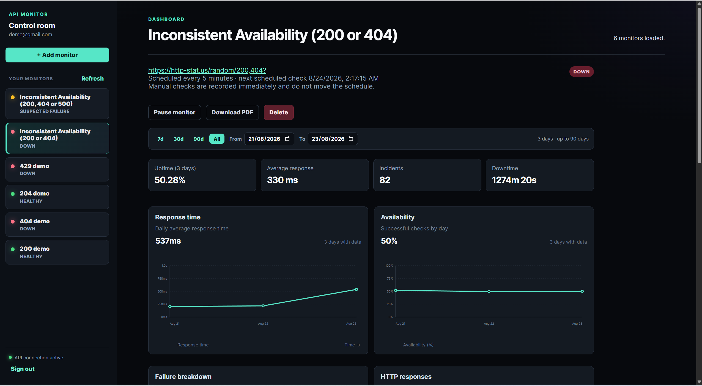

# API Monitor

A focused API monitoring service built with **Cloudflare Workers, Hono, Supabase PostgreSQL, React, and Vite**.

API Monitor lets users create HTTP/HTTPS monitors, automatically check endpoint health, track response times and failures, detect incidents, view historical statistics, and generate PDF reports.

The backend runs on **Cloudflare Workers**, scheduled monitoring uses **Cloudflare Cron**, and persistent data is stored in **Supabase PostgreSQL**.



---

## Table of Contents

* [Overview](#overview)
* [Problem](#problem)
* [10x Claim](#10x-claim)
* [Core Features](#core-features)
* [Functionalities Implemented](#functionalities-implemented)
* [Architecture](#architecture)
* [Tech Stack](#tech-stack)
* [Project Structure](#project-structure)
* [Prerequisites](#prerequisites)
* [Environment Variables](#environment-variables)
* [Database Setup](#database-setup)
* [Local Development](#local-development)
* [Testing](#testing)
* [Production Deployment](#production-deployment)
* [Production Verification](#production-verification)
* [API](#api)
* [5-Minute Demo](#5-minute-demo)
* [Security](#security)
* [Limitations and Non-Goals](#limitations-and-non-goals)
* [Future Ideas](#future-ideas)

---

# Overview

API Monitor is an authenticated monitoring service for developers, small teams, and API owners who need a simple way to answer:

> **Is my API healthy, and what has happened to it recently?**

Users create monitors by providing an HTTP/HTTPS URL and monitoring interval.

The system periodically performs real HTTP requests and records:

* Availability
* HTTP status
* Response time
* Failure type
* Check history
* Incidents
* Recovery events
* Uptime statistics
* Daily historical statistics

Users can also generate PDF reports for their monitors.

---

# Problem

Developers often check APIs manually when investigating availability or performance problems.

This requires repeatedly checking:

* Whether an endpoint responds
* What status it returns
* How long it takes
* When failures started
* Whether the endpoint recovered
* How frequently failures occurred

Manual checking also makes it difficult to build a useful historical record.

API Monitor automates this workflow by periodically checking endpoints, storing results, detecting incidents, and presenting the information in one place.

---

# 10x Claim

API Monitor aims to make routine API health monitoring and recent reliability analysis at least 10x easier by replacing repeated manual checks and manual history reconstruction with automated monitoring, confirmed incident detection, recovery tracking, and historical statistics.

Instead of manually performing requests and recording results, the system automatically provides:

* Current health
* Recent checks
* Response times
* Failure information
* Incidents
* Recovery events
* Uptime statistics
* Historical trends
* PDF reports

The intended improvement is from **repeated manual checking taking minutes** to **reviewing automatically collected information in seconds**.

---

# Core Features

The capstone is intentionally limited to five core feature areas.

### 1. Monitor Management

Authenticated users can:

* Create monitors
* List their monitors
* View a monitor
* Update monitor configuration
* Delete monitors
* Enable or disable monitoring

Each monitor has a configurable URL and monitoring interval.

A database-enforced quota limits each user to **25 monitors**.

### 2. Automated Monitoring

Cloudflare Cron invokes the Worker scheduler.

The scheduler:

1. Finds monitors that are due.
2. Claims them safely.
3. Performs bounded HTTP checks.
4. Records the result.
5. Updates monitor health.
6. Processes incident transitions.

The scheduler is intentionally bounded by configurable batch and concurrency limits.

### 3. Check History

Each check can record:

* Timestamp
* Success/failure
* HTTP status
* Response time
* Failure type
* Error information
* Execution key

Raw check history is retained for approximately **30 days**.

### 4. Incident Detection

A single failed request does not immediately create an outage.

The monitor state machine is:

```text
HEALTHY
   │
   │ first consecutive failure
   ▼
SUSPECTED_FAILURE
   │
   │ second consecutive failure
   ▼
DOWN
   │
   │ successful check
   ▼
HEALTHY
```

An incident is opened when a monitor reaches `DOWN` and resolved when a later successful check is received.

### 5. Statistics and Reports

The application provides:

* Total checks
* Successful checks
* Failed checks
* Uptime percentage
* Average response time
* Minimum response time
* Maximum response time
* Incident count
* Total downtime
* Daily historical statistics
* PDF reports

---

# Functionalities Implemented


| Concept                    | Where it lives                                        | Evidence                                           |
| -------------------------- | ----------------------------------------------------- | -------------------------------------------------- |
| **API endpoints**          | Hono routes under `src/`                              | REST API, validation, authentication, status codes |
| **Database**               | `supabase/migration/0001_initial_schema.sql`          | PostgreSQL persistence, indexes, functions, RLS    |
| **Authentication**         | Worker auth middleware + Supabase Auth                | Bearer-token authentication and protected routes   |
| **Background jobs / Cron** | Worker `scheduled()` handler + Wrangler configuration | Automated monitoring and retention                 |
| **Reporting — PDF**        | PDF report service/route                              | Protected PDF report endpoint                      |
| **Caching logic**          | Statistics service                                    | Short-TTL statistics cache                         |
| **Rate limiting / quotas** | API boundary + database functions                     | Request limits and 25-monitor quota                |

**Swaps:** Only 1 (Rate Limiting / quotas)

---

# Architecture

```text
                         Browser
                            │
                            │ HTTPS
                            ▼
              ┌─────────────────────────┐
              │    Cloudflare Worker    │
              │                         │
              │ Hono REST API           │
              │ Authentication          │
              │ Monitor management      │
              │ Statistics              │
              │ PDF reports             │
              │ Cron scheduler          │
              │ Frontend assets         │
              └────────────┬────────────┘
                           │
                           ▼
                 ┌──────────────────┐
                 │     Supabase     │
                 │                  │
                 │ Auth             │
                 │ PostgreSQL       │
                 │ RLS              │
                 └──────────────────┘

                    Cloudflare Cron
                           │
                           ▼
                    Scheduled checks
                           │
                           ▼
                    Monitored APIs
```

### Production model

A single Cloudflare deployment serves:

* React/Vite frontend assets
* Hono API
* Authentication integration
* Monitoring scheduler
* Cron-triggered background work

Supabase provides:

* Authentication
* PostgreSQL persistence
* Row Level Security
* Transactional database functions

---

# Tech Stack

| Technology           | Purpose                                          |
| -------------------- | ------------------------------------------------ |
| React                | Frontend                                         |
| Vite                 | Frontend development/build                       |
| TypeScript           | Type safety                                      |
| Hono                 | Worker API framework                             |
| Cloudflare Workers   | Backend runtime and hosting                      |
| Cloudflare Cron      | Scheduled monitoring                             |
| Supabase Auth        | Authentication                                   |
| Supabase PostgreSQL  | Persistent database                              |
| PostgreSQL functions | Scheduling, state transitions, quotas, retention |
| Row Level Security   | User data isolation                              |
| PDF-lib              | PDF reports                                      |
| Zod                  | Validation                                       |
| Vitest               | Automated testing                                |
| Wrangler             | Cloudflare development and deployment            |

---

# Project Structure

```text
.
├── frontend/
│   ├── ...
│   ├── vite.config.ts
│   └── .env.example
│
├── src/
│   ├── ...
│   └── index.ts
│
├── tests/
│   └── ...
│
├── supabase/
│   └── migration/
│       └── 0001_initial_schema.sql
│
├── docs/
│   └── openapi.yaml
│
├── package.json
├── wrangler.toml.example
├── .dev.vars.example
├── .env.example
└── README.md
```

---

# Prerequisites

Install:

* Node.js 20+
* npm
* Git
* A Supabase project
* A Cloudflare account for production deployment

Verify your local installation:

```bash
node --version
npm --version
git --version
```

Wrangler is used through the project's development dependency, so a global Wrangler installation is not required.

---

# Environment Variables

The application separates **browser-safe configuration** from **Worker secrets**. Please refer to all the example files for better understanding.

## Worker variables

The Worker uses:

```text
SUPABASE_URL
SUPABASE_PUBLISHABLE_KEY
SUPABASE_SECRET_KEY

APP_ORIGIN

MAX_SCHEDULE_BATCH
MAX_SCHEDULE_BATCHES
CHECK_CONCURRENCY
STATISTICS_CACHE_TTL_SECONDS
```

Development-only options:

```text
ALLOW_MANUAL_CHECKS
ALLOW_ONE_MINUTE_INTERVAL
```

## Frontend variables

The frontend uses:

```text
VITE_SUPABASE_URL
VITE_SUPABASE_PUBLISHABLE_KEY
VITE_API_BASE_URL
```

The frontend must **never** receive `SUPABASE_SECRET_KEY`.

### Local API URL

For local development:

```text
VITE_API_BASE_URL=http://127.0.0.1:8787/api/v1
```

### Production API URL

For production:

```text
VITE_API_BASE_URL=https://YOUR-WORKER-URL/api/v1
```

Replace `YOUR-WORKER-URL` with the actual deployed Worker URL.

---

# Database Setup

Create a Supabase project and obtain:

```text
Supabase project URL
Supabase publishable key
Supabase secret key
```

Apply the migration:

```text
supabase/migration/0001_initial_schema.sql
```

You can apply it using the Supabase SQL Editor on Supabase by simply copy/pasting from **.sql** file or may go with your preferred Supabase database workflow.

The migration creates the main tables:

```text
monitors
check_results
incidents
daily_monitor_statistics
```

It also creates the required:

* Indexes
* RLS policies
* Triggers
* Scheduling functions
* Quota functions
* Check transition functions
* Retention/aggregation functions

Verify that the migration completed successfully before starting the Worker.

---

# Local Development

Local development uses **two processes**:

```text
React/Vite
localhost:5173
      │
      │ API requests
      ▼
Cloudflare Worker / Wrangler
127.0.0.1:8787
      │
      ▼
Supabase
```

## 1. Clone and install

```bash
git clone <REPOSITORY_URL>
cd api-monitor
npm install
```

## 2. Configure local environment

Use the repository examples as references:

```text
.dev.vars.example
frontend/.env.example
.env.example
```

Create your local environment files and provide your Supabase development credentials.

Do not commit real credentials ever.

## 3. Start the Worker

Terminal 1:

```bash
npm run dev
```

The Worker normally runs at:

```text
http://127.0.0.1:8787
```

## 4. Start the frontend

Terminal 2:

```bash
npm run dev:web
```

Vite normally runs at:

```text
http://localhost:5173
```

Open:

```text
http://localhost:5173
```

## 5. Test the local workflow

A basic local workflow is:

1. Create an account.
2. Sign in.
3. Create a monitor.
4. View the monitor.
5. Run a development manual check multiple times to populate data.
6. Use publicily available endpoints like **https://http-stat.us/random/200,404?** or **https://http-stat.us/random/200,404,500?** etc, to randomly record the http status multiple times.

8. View statistics on the dashboard.
9. Generate a PDF report.

---

# Local Scheduled Monitoring

Production monitoring is triggered by **Cloudflare Cron**.

Local Wrangler development should not be treated as an exact simulation of deployed Cloudflare Cron behavior.

For local development, the project supports development-only manual checking:

```text
ALLOW_MANUAL_CHECKS=true
```

and optionally:

```text
ALLOW_ONE_MINUTE_INTERVAL=true
```

These settings are for development and testing.

They will not be enabled in production as you change the environment credentials to production URL after deployment.

The production scheduler uses the configured Cloudflare Cron triggers after deployment.

---

# Testing

Run the test suite:

```bash
npm test
```

Build the production application:

```bash
npm run build
```

The test suite covers important application behavior such as:

* Authentication
* Ownership checks
* Validation
* Monitor quotas
* Rate limiting
* Failure transitions
* Incident creation/recovery
* Idempotent transitions
* Statistics
* PDF generation

---

# Production Deployment

Production consists of:

```text
Cloudflare Worker
        │
        ├── React/Vite assets
        ├── Hono API
        └── Cloudflare Cron
                 │
                 ▼
             Supabase
```

There is no separate frontend hosting deployment required.

---

## 1. Prepare Supabase

Use your production Supabase project by simply creating new project on Supabase dashboard and simply change the credentials. You may also go with the same project and keep the same credentials.

Verify:

* Supabase Auth is enabled.
* The database exists.
* The migration has been applied.
* Required tables exist.
* RLS policies exist.
* Required PostgreSQL functions exist.

---

## 2. Authenticate Wrangler

Log in:

```bash
npx wrangler login
```

Verify the account:

```bash
npx wrangler whoami
```

Make sure the correct Cloudflare account is selected.

---

## 3. Configure Wrangler

Use:

```text
wrangler.toml.example
```

as the basis for your production Wrangler configuration.

The important sections are similar to:

```toml
name = "10x-api-monitor"
main = "src/index.ts"

[assets]
directory = "./dist/frontend"
not_found_handling = "single-page-application"

[triggers]
crons = ["*/5 * * * *", "15 1 * * *"]
```

The Cron schedules represent:

```text
*/5 * * * *   → monitoring scheduler
15 1 * * *    → retention/aggregation job
```

Adjust the Worker name and other configuration for your deployment.

---

## 4. Configure production secrets

Store sensitive Supabase credentials as Worker secrets.

```bash
npx wrangler secret put SUPABASE_URL
npx wrangler secret put SUPABASE_PUBLISHABLE_KEY
npx wrangler secret put SUPABASE_SECRET_KEY
```

Wrangler will prompt for each value.

Never ever commit or expose these values to Git or any public platform.

### Important

This project expects:

```text
SUPABASE_SECRET_KEY
```

Do not rename it to another variable unless the application configuration is changed accordingly.

The secret key is server-side only.

---

## 5. Configure production variables

Set the production application origin:

```text
APP_ORIGIN=https://YOUR-WORKER-URL
```

Configure normal scheduler settings such as:

```text
MAX_SCHEDULE_BATCH=25
MAX_SCHEDULE_BATCHES=2
CHECK_CONCURRENCY=5
STATISTICS_CACHE_TTL_SECONDS=180
```

Do not enable development-only settings in production:

```text
ALLOW_MANUAL_CHECKS
ALLOW_ONE_MINUTE_INTERVAL
```

unless they are intentionally required.

---

## 6. Configure the frontend

Before building, make sure the frontend points to the deployed API.

For example:

```text
VITE_API_BASE_URL=https://YOUR-WORKER-URL/api/v1
```

Also configure:

```text
VITE_SUPABASE_URL
VITE_SUPABASE_PUBLISHABLE_KEY
```

The Supabase secret key must not appear in any `VITE_*` variable.

---

## 7. Build

Run:

```bash
npm test
npm run build
```

The frontend build is placed in:

```text
dist/frontend
```

---

## 8. Deploy

Deploy the Worker and frontend assets:

```bash
npx wrangler deploy
```

Wrangler will display the deployed Worker URL.

---

# Production Verification

After deployment, verify the complete system instead of assuming that a successful deployment means everything works.

## 1. Health check

If the health endpoint is enabled:

```bash
curl https://YOUR-WORKER-URL/health
```

Expected response:

```json
{
  "status": "ok"
}
```

## 2. Frontend

Open:

```text
https://YOUR-WORKER-URL
```

Verify:

* Frontend loads.
* Authentication works.
* No API requests point to `localhost`.
* A monitor can be created.
* A monitor can be updated.
* A monitor can be deleted.

## 3. Scheduled monitoring

Create an enabled monitor and allow the Cron scheduler to run.

The production scheduler runs every five minutes:

```text
*/5 * * * *
```

Inspect Worker logs:

```bash
npx wrangler tail YOUR-WORKER-NAME
```

Verify that:

```text
Cron
  ↓
Scheduler
  ↓
Due monitor claimed
  ↓
HTTP request executed
  ↓
Check result stored
  ↓
Monitor state updated
```

## 4. Incident handling

Use a controlled endpoint that can produce failures (refer [here](#5-test-the-local-workflow)).

Verify:

```text
HEALTHY
   ↓
SUSPECTED_FAILURE
   ↓
DOWN
   ↓
Incident opened
   ↓
Successful check
   ↓
HEALTHY
   ↓
Incident resolved
```

## 5. Reports and statistics

Verify:

* Check history
* Statistics
* Cached statistics
* Incident history
* PDF report generation

---

# API

The API is documented in:

```text
docs/openapi.yaml
```

Base path:

```text
/api/v1
```

Protected endpoints use:

```http
Authorization: Bearer <JWT>
```

## Monitors

```text
GET    /api/v1/monitors
POST   /api/v1/monitors
GET    /api/v1/monitors/{id}
PATCH  /api/v1/monitors/{id}
DELETE /api/v1/monitors/{id}
```

## Check history

```text
GET /api/v1/monitors/{id}/checks
```

## Incidents

```text
GET /api/v1/monitors/{id}/incidents
```

## Statistics

```text
GET /api/v1/monitors/{id}/statistics
```

## PDF report

```text
GET /api/v1/monitors/{id}/report
```

Returns:

```text
application/pdf
```

## Development manual check

```text
POST /api/v1/monitors/{id}/check
```

This endpoint is intended for development/testing and should not be treated as the production scheduling mechanism.

---

# 5-Minute Demo

A stranger should be able to demonstrate the project without additional explanation.

### 1. Open the application

Open the deployed URL or local frontend. Note that in production environment, you can only schedule the checks at minimun 5 mins interval and cannot run them manually on your own. Use local environment if you need to populate as much data as you want in lesser time to observe statistics on dashboard.

### 2. Sign in

Use a demo account or create an account.

### 3. Create a monitor

Provide:

* Name
* HTTP/HTTPS URL
* Monitoring interval

### 4. Show monitoring

Show:

* Current health
* Last check
* Response time
* Check history

### 5. Show an incident

Use a controlled failing endpoint to demonstrate:

```text
HEALTHY → SUSPECTED_FAILURE → DOWN
```

Then restore it:

```text
DOWN → HEALTHY
```

### 6. Show statistics

Demonstrate:

* Uptime
* Response times
* Success/failure counts
* Incidents
* Downtime

### 7. Generate a report

Download the PDF report.

### 8. Explain the architecture

```text
React/Vite
    ↓
Cloudflare Worker + Hono
    ↓
Supabase PostgreSQL

Cloudflare Cron
    ↓
Automated monitoring
```

---

# Security

The project separates browser-safe values from server-side secrets.

## Never commit

Do not commit:

* Supabase secret keys
* API keys
* Passwords
* `.dev.vars`
* Production environment files
* Generated private data

Use environment variables and Cloudflare Worker secrets.

## Supabase secret key

`SUPABASE_SECRET_KEY` must:

* Remain server-side
* Never be exposed through `VITE_*`
* Never be committed
* Never be logged

## Frontend credentials

The frontend may use:

```text
VITE_SUPABASE_URL
VITE_SUPABASE_PUBLISHABLE_KEY
```

User data is still protected by authentication, ownership checks, and database RLS.

## Data isolation

RLS protects user-owned monitoring data, including:

```text
monitors
check_results
incidents
daily_monitor_statistics
```

---

# Data Retention

Raw check results are retained for approximately **30 days**.

Older data is aggregated into daily statistics before raw records are removed.

This allows the application to retain long-term information without keeping every individual check indefinitely.

Long-term statistics include information such as:

* Check counts
* Uptime
* Response-time statistics
* Incident counts
* Downtime

---

# Limitations and Non-Goals

API Monitor intentionally does not attempt to become a full observability platform.

It does not provide:

* Instant Alert on endpoint's suspected or confirmed failure.
* Distributed tracing
* Log aggregation
* Infrastructure monitoring
* Full APM
* Multi-region monitoring agents
* Billing/subscriptions
* Enterprise organizations
* Mobile applications
* Complex alert routing
* Arbitrary custom metrics

The project focuses on one problem:

> **Simple, automated HTTP/API availability monitoring with useful historical information.**

---

# Future Ideas

Potential future improvements include:

* Alerts through email or other means
* Multi-region monitoring
* Team accounts
* Shared monitors
* Custom alert thresholds
* Response-body assertions
* Expected status-code configuration
* SSL certificate monitoring
* Advanced analytics
* Longer configurable retention
* External incident integrations
* Monitor grouping and tagging

---

# Useful Commands

## Install

```bash
npm install
```

## Local Worker

```bash
npm run dev
```

## Local frontend

```bash
npm run dev:web
```

## Tests

```bash
npm test
```

## Test watch mode

```bash
npm run test:watch
```

## Lint/type validation

```bash
npm run lint
```

## Production build

```bash
npm run build
```

## Wrangler login

```bash
npx wrangler login
```

## Verify Cloudflare account

```bash
npx wrangler whoami
```

## Deploy

```bash
npx wrangler deploy
```

## Tail Worker logs

```bash
npx wrangler tail YOUR-WORKER-NAME
```

## Production health check

```bash
curl https://YOUR-WORKER-URL/health
```

---

# Troubleshooting

### Frontend calls `localhost` in production

Check:

```text
VITE_API_BASE_URL
```

It must point to:

```text
https://YOUR-WORKER-URL/api/v1
```

Then rebuild and deploy:

```bash
npm run build
npx wrangler deploy
```

### Worker reports an invalid Supabase URL

Check:

```text
SUPABASE_URL
```

It should be a valid HTTPS Supabase project URL.

### Monitor creation fails

Inspect Worker logs:

```bash
npx wrangler tail YOUR-WORKER-NAME
```

Then verify that the database migration and monitor creation function were applied successfully.

### Cron appears inactive

Check:

1. Cron configuration in Wrangler.
2. Worker deployment.
3. Worker logs.
4. Monitor is enabled.
5. Monitor has a due `next_check_at`.
6. Production Supabase credentials are configured.

Use:

```bash
npx wrangler tail YOUR-WORKER-NAME
```

---

# Definition of Done

## Problem and scope

* [ ] Problem is clearly documented.
* [ ] Intended users are documented.
* [ ] 10x claim is documented.
* [ ] Core scope is limited.
* [ ] Non-goals are documented.

## Capstone concepts

* [ ] API endpoints
* [ ] Database
* [ ] Authentication
* [ ] Background jobs/Cron
* [ ] PDF reporting
* [ ] Caching
* [ ] Rate limiting/quotas
* [ ] At least five concepts implemented
* [ ] 1 swap used

## Runnable system

* [ ] `npm install` works.
* [ ] Worker starts with `npm run dev`.
* [ ] Frontend starts with `npm run dev:web`.
* [ ] Database migration is documented.
* [ ] Environment variables are documented.
* [ ] Tests run with `npm test`.
* [ ] Production build succeeds.
* [ ] Wrangler deployment works.

## Stranger test

* [ ] A new developer can understand the problem.
* [ ] A new developer can configure the project.
* [ ] A new developer can run it locally.
* [ ] A new developer can follow the 5-minute demo.
* [ ] Production deployment steps are documented.
* [ ] Production Cron execution can be verified.

## Security

* [ ] No secrets are committed.
* [ ] Environment files are ignored.
* [ ] Supabase secret key is server-side only.
* [ ] Protected resources enforce ownership.
* [ ] User data is protected by RLS.
* [ ] No private third-party data is included.

---

# Quick Start

For local development:

```bash
git clone <REPOSITORY_URL>
cd api-monitor
npm install
```

Configure the local environment and apply:

```text
supabase/migration/0001_initial_schema.sql
```

Start the Worker:

```bash
npm run dev
```

In another terminal, start the frontend:

```bash
npm run dev:web
```

Open:

```text
http://localhost:5173
```

Run tests:

```bash
npm test
```

Build:

```bash
npm run build
```

For production:

```bash
npx wrangler login
npx wrangler whoami
npm run build
npx wrangler deploy
```

Then verify the deployed application, API, authentication, scheduled monitoring, statistics, incidents, and PDF reporting.

---

# Capstone Summary

API Monitor is a scoped backend-focused solution for automated API health monitoring.

It implements all seven original capstone concepts:

1. API endpoints
2. Database
3. Authentication
4. Background jobs / Cron
5. PDF reporting
6. Caching
7. Rate limiting / quotas

**Swaps:** 1.

**Core problem:** Reduce the manual effort required to determine whether an API is healthy and understand its recent history.

**Non-goal:** Building a full multi-region observability platform.

The project demonstrates an end-to-end progression from:

```text
Problem
   ↓
Walking skeleton
   ↓
API + database
   ↓
Authentication
   ↓
Scheduled monitoring
   ↓
Incident detection
   ↓
Statistics + caching
   ↓
PDF reporting
   ↓
Quotas
   ↓
Production deployment
```

The goal is a **small, understandable system that runs end-to-end and demonstrates the capstone concepts clearly**.